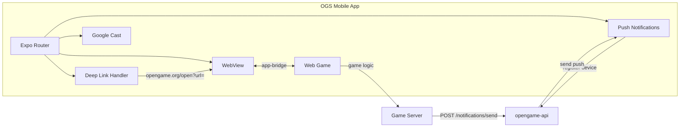
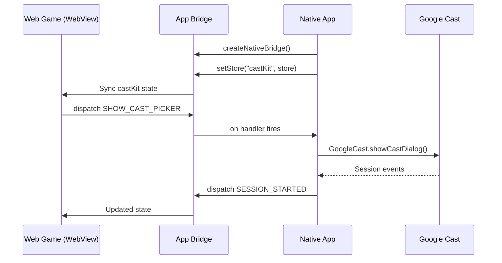
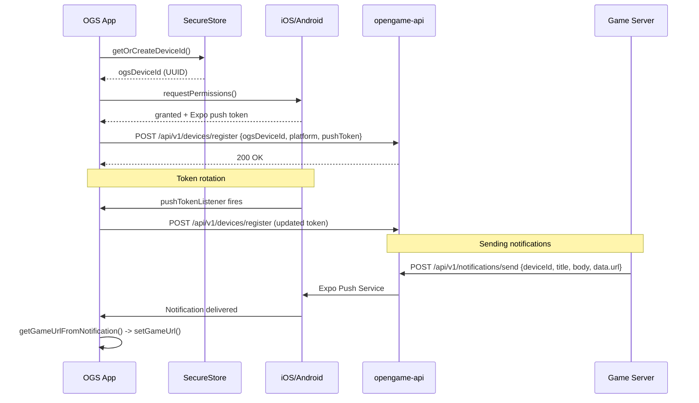
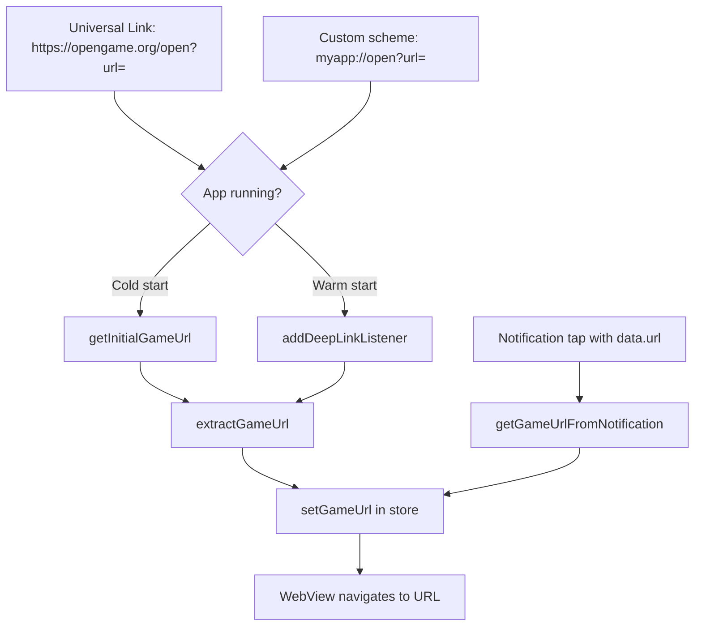
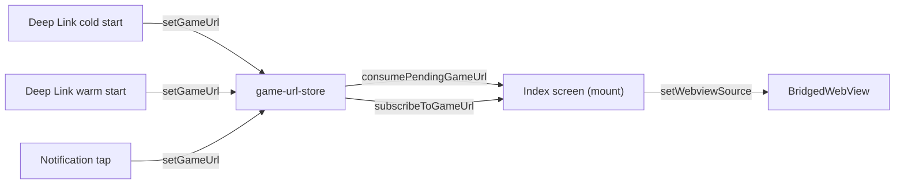
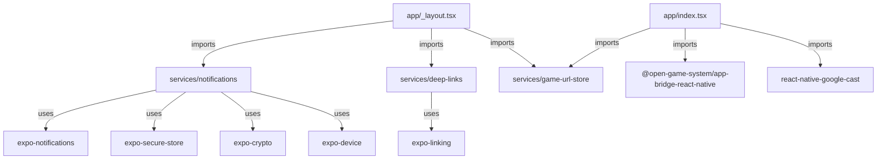

# Architecture

## System Overview

opengame-app is the native mobile shell in the Open Game System (OGS) ecosystem. Web games run inside a WebView; the app provides native capabilities they cannot access on their own.

## App Bridge / WebView Integration

The app uses `@open-game-system/app-bridge-react-native` to create a two-way communication channel between the native app and web games loaded in the WebView.

### CastKit Store

The `castKit` store is the only registered store. It tracks:

- `castState` -- Google Cast connection state (NOT_CONNECTED, CONNECTING, CONNECTED, NO_DEVICES_AVAILABLE)
- `devicesAvailable` -- whether cast-capable devices are on the network
- `sessionState` -- CONNECTED, DISCONNECTED, or CONNECTING

Events: `CAST_STATE_CHANGED`, `DEVICES_DISCOVERED`, `SESSION_STARTED`, `SESSION_ENDED`, `SESSION_RESUMED`, `SHOW_CAST_PICKER`

## Push Notification Flow

No auth-kit dependency for MVP. The OGS app IS the identity layer.

### Key Details

- `ogsDeviceId` is a UUID persisted in `expo-secure-store` (survives app reinstalls on iOS)
- Push token is an Expo push token (not raw APNs/FCM)
- API base URL: `https://api.opengame.org`
- Android sets up a notification channel named "Default" with MAX importance
- Foreground notifications display alerts, play sound, show banner and list

## Deep Link Handling

Two entry paths into the app, both routed through Universal Links:

### URL Format

- Universal Link: `https://opengame.org/open?url=<encoded_game_url>`
- Custom scheme: `myapp://open?url=<encoded_game_url>`
- Both parse the `url` query parameter from the `/open` path

### Platform Configuration

- **iOS:** `associatedDomains: ["applinks:opengame.org"]` in app.json
- **Android:** Intent filter for `https://opengame.org/open` with `autoVerify: true`

## Game URL Store

A minimal observable store that decouples URL sources from the WebView consumer.

The store holds a `pendingUrl` and a list of listeners. On mount, the Index screen calls `consumePendingGameUrl()` (clears it), then `subscribeToGameUrl()` for subsequent changes.

## Module Dependency Graph

