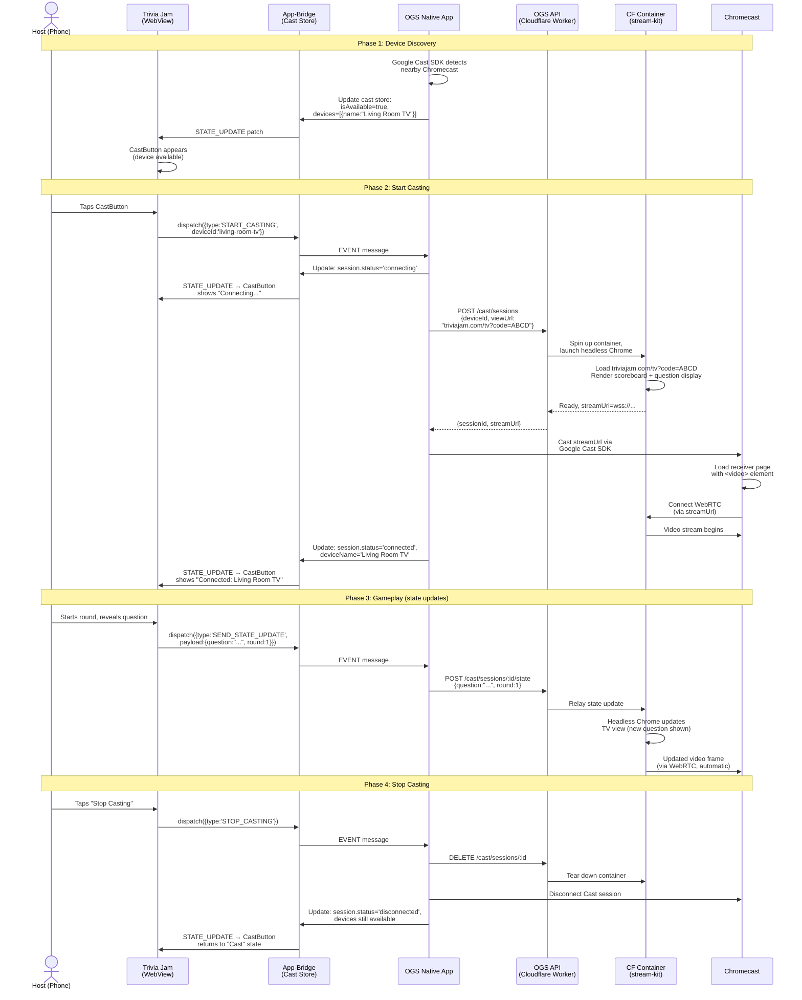

# Cast-Kit Architecture: App-Bridge + Stream-Kit

**Date:** 2026-03-14
**Status:** Accepted
**Supersedes:** N/A (cast-kit's standalone bridge was never formally decided)

## Context

Cast-kit has two architectural problems:

### Problem 1: Standalone bridge duplicates app-bridge

Cast-kit has its own bridge abstraction (`WebViewBridge`, `HttpBridge`) with request-response semantics that duplicates what app-bridge already provides. This creates two message protocols on the same WebView postMessage channel, two state models for consumers to learn, and an architecture mismatch already visible in trivia-jam (where `CastButton` reads from an app-bridge store but tests use cast-kit's standalone mock).

### Problem 2: Browser-on-TV receiver is wrong

The current cast-kit receiver assumes the Chromecast loads a full web page and renders the game's TV view in the browser. This is fragile — Chromecast's built-in browser is slow, uses an old Chrome version, and has limited GPU. The entire reason stream-kit exists is to render game views server-side on Cloudflare Containers with headless Chrome and stream the output as video via WebRTC.

**Cast-kit should orchestrate stream-kit sessions, not render games on TV hardware.**

## Decision

### Cast-Kit's Role

Cast-kit is the **orchestration layer** between the player's phone and a TV display. It does not render anything. The end-to-end casting flow is:

```
┌─ Phone (WebView) ────────────────────────────────────┐
│  Game dispatches: { type: 'START_CASTING', deviceId } │
│  via app-bridge cast store                            │
└───────────────────────────────────────────────────────┘
        │ app-bridge event
        ▼
┌─ OGS Native App ─────────────────────────────────────┐
│  1. Receives START_CASTING event from cast store      │
│  2. Calls API: POST /cast/sessions                    │
│     { deviceId, gameUrl, viewUrl (TV view URL) }      │
│  3. API spins up stream-kit session on CF Container   │
│  4. Container launches headless Chrome → loads viewUrl│
│  5. API returns streamUrl (WebRTC signaling endpoint) │
│  6. Native app sends streamUrl to Chromecast/AirPlay  │
│  7. Updates cast store: session.status = 'connected'  │
└───────────────────────────────────────────────────────┘
        │ Chromecast receiver URL
        ▼
┌─ TV (Chromecast) ────────────────────────────────────┐
│  Loads simple receiver page with <video> element      │
│  Connects to WebRTC stream from CF Container          │
│  Displays rendered game video — no game logic here    │
└───────────────────────────────────────────────────────┘
        ▲ WebRTC video stream
        │
┌─ CF Container (stream-kit) ──────────────────────────┐
│  Headless Chrome renders the game's TV view URL       │
│  Encodes output as video → streams via WebRTC         │
│  Receives game state updates via API/WebSocket        │
│  Re-renders as state changes                          │
└───────────────────────────────────────────────────────┘
```

### Game State Update Flow

When the game state changes on the phone:

1. Game dispatches `{ type: 'SEND_STATE_UPDATE', payload }` via app-bridge cast store
2. Native app receives event, forwards to API: `POST /cast/sessions/:id/state`
3. API relays state to the CF Container running the stream-kit session
4. Headless browser receives state update, re-renders the TV view
5. Updated video frame streams to TV via existing WebRTC connection

### App-Bridge Store Definition

```typescript
type CastDevice = {
  id: string;
  name: string;
  type: 'chromecast' | 'airplay';
};

type CastState = {
  isAvailable: boolean;
  devices: CastDevice[];
  session: {
    status: 'disconnected' | 'connecting' | 'connected';
    deviceId: string | null;
    deviceName: string | null;
    sessionId: string | null;
    streamSessionId: string | null; // stream-kit session ID
  };
  error: string | null;
};

type CastEvents =
  | { type: 'SCAN_DEVICES' }
  | { type: 'START_CASTING'; deviceId: string }
  | { type: 'STOP_CASTING' }
  | { type: 'SEND_STATE_UPDATE'; payload: unknown }
  | { type: 'SHOW_CAST_PICKER' }
  | { type: 'RESET_ERROR' };
```

### API Endpoints (new)

The API becomes the broker between the native app and stream-kit:

- `POST /cast/sessions` — Create a cast session (spins up stream-kit container, returns stream URL)
- `GET /cast/sessions/:id` — Get session status
- `POST /cast/sessions/:id/state` — Push game state update to the container
- `DELETE /cast/sessions/:id` — End session (tears down container)

### Package Structure

- **cast-kit-core** — `CastState`, `CastEvents`, `CastDevice` types, Zod schemas, app-bridge helper functions (`getCastState()`, `onCastStateChange()`, `dispatchCastEvent()`)
- **cast-kit-react** — React hooks and components over app-bridge-react (`useCastState()`, `useCastSession()`, `CastButton`, `DeviceList`)
- **Remove from cast-kit**: standalone bridge (`WebViewBridge`, `HttpBridge`), `CastKitClient` class, standalone mock, current receiver (interactive DOM on TV)
- **New receiver**: Simple page with `<video>` element that connects to a WebRTC stream. This is a stream-kit-web consumer, not cast-kit code. Lives in `examples/` or as a deployable receiver app.

### What Each System Owns

| System | Responsibility |
|--------|---------------|
| **cast-kit** (app-bridge store) | Device discovery state, session lifecycle, game-side UI (CastButton) |
| **Native app** | Cast SDK integration (device scanning), API calls to broker sessions |
| **API** (`/cast/*` routes) | Session management, stream-kit container orchestration |
| **stream-kit** (CF Container) | Headless rendering of TV view, WebRTC video encoding/streaming |
| **Receiver page** | Minimal `<video>` element connecting to WebRTC stream |

### Example: Trivia Jam Casting Flow



In this flow, Trivia Jam provides two things:
1. **Game URL** — `triviajam.com/play?code=ABCD` (runs in OGS WebView on phone)
2. **TV View URL** — `triviajam.com/tv?code=ABCD` (rendered server-side by stream-kit)

The TV view is a read-only display (scoreboard, current question, timer) that re-renders when state updates arrive. It never runs on the Chromecast itself — stream-kit renders it in a headless browser and streams video.

## Consequences

- **Stream-kit is a runtime dependency of casting** — casting won't work without CF Container infrastructure. This is intentional: consistent rendering quality regardless of TV hardware.
- **API is in the critical path** — every cast session requires an API call to spin up a container. The API needs `/cast/*` routes that orchestrate stream-kit.
- **No game code runs on the TV** — the receiver is a dumb video player. Game developers provide a `viewUrl` (their TV view) that stream-kit renders server-side.
- **Cost model changes** — casting has server cost (CF Container per session) rather than being free (Chromecast browser). Trade-off is worth it for rendering quality and device compatibility.
- **Current cast-kit receiver is deleted** — the interactive DOM receiver (`CastKitReceiver`, `initReceiver()`, `getGameParams()`) is replaced by a simple WebRTC video receiver page.
- **Single message protocol** — all phone↔native communication goes through app-bridge stores. No standalone bridge.
- **Trivia-jam unblocked** — `CastButton` uses `useStore('cast')` from app-bridge-react, tests use app-bridge-testing mocks, Storybook gets one bridge decorator.
- **Game developer experience** — game provides two URLs: the game URL (played on phone in WebView) and the TV view URL (rendered server-side by stream-kit). Cast-kit handles everything else.
