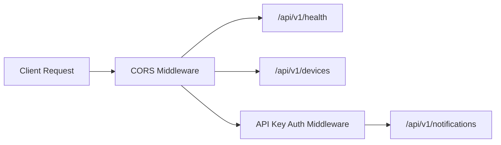
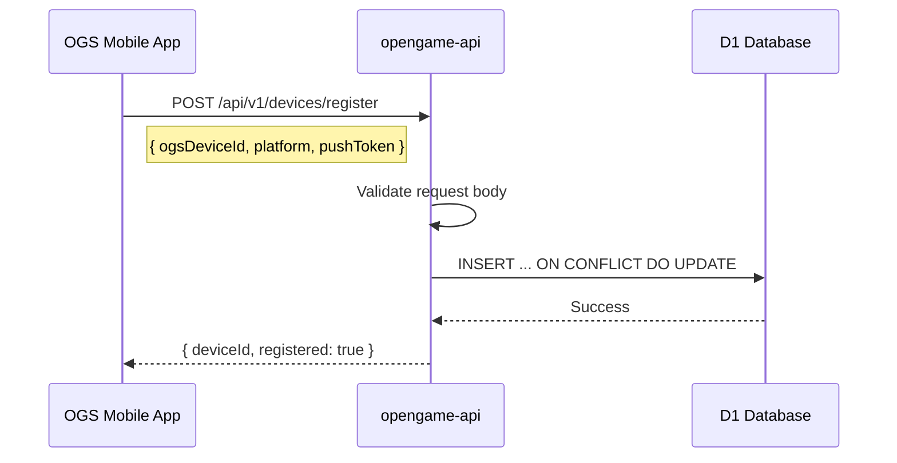
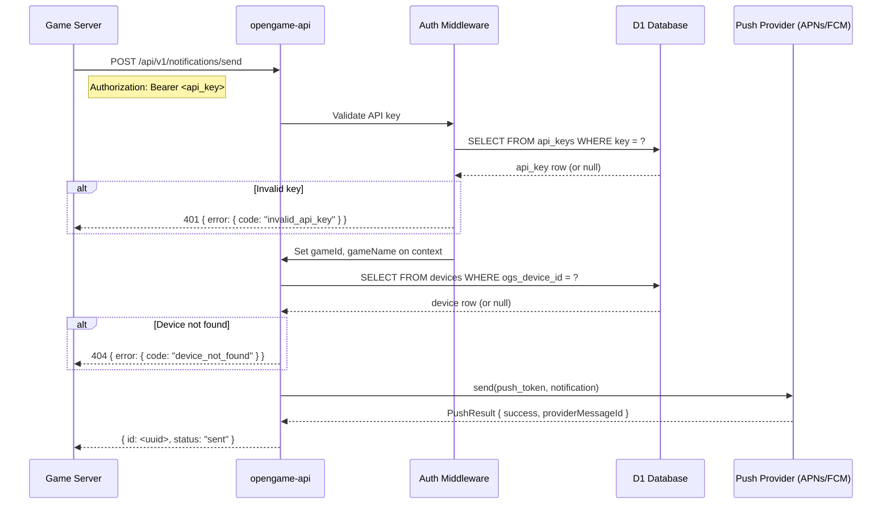
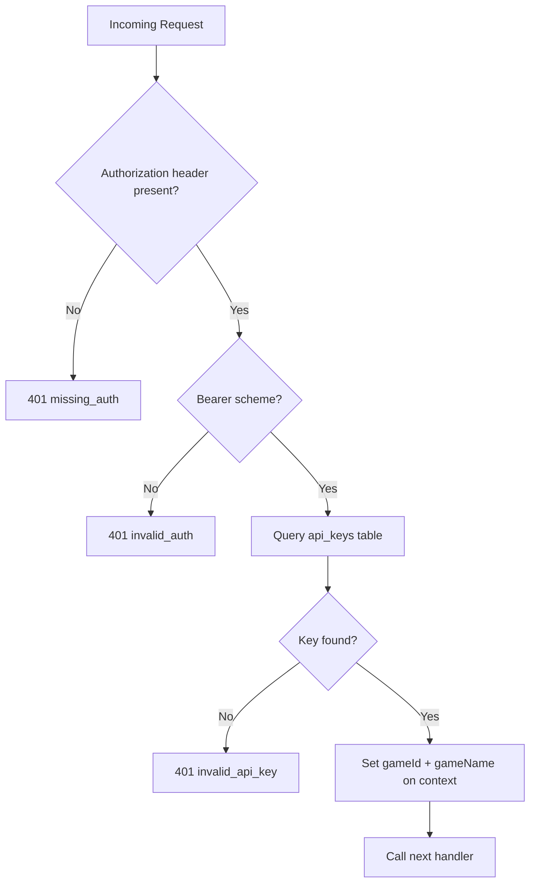
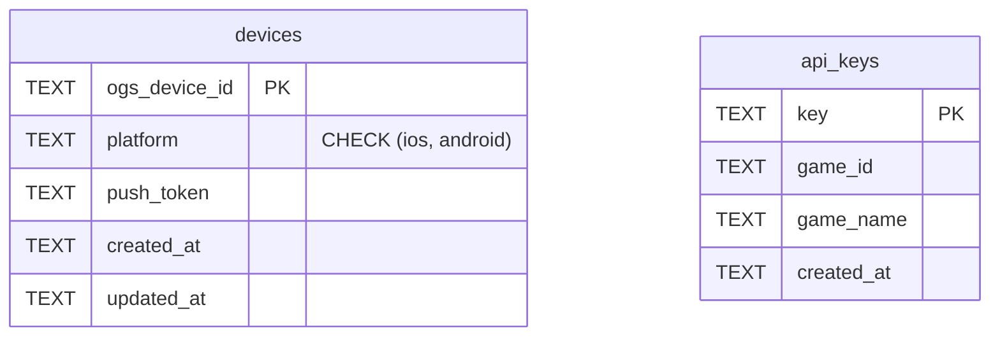

# Architecture

## Overview

opengame-api is a Cloudflare Workers API built with Hono that serves as a push notification relay for the Open Game System. It has two primary functions:

1. **Device registration** -- the OGS mobile app registers its push token
2. **Notification dispatch** -- game servers send push notifications to registered devices

## API Route Structure



### Endpoints

| Method | Path | Auth | Description |
|--------|------|------|-------------|
| GET | `/api/v1/health` | None | Health check, returns `{ status: "ok" }` |
| POST | `/api/v1/devices/register` | None | Register/update a device push token |
| POST | `/api/v1/notifications/send` | Bearer API key | Send a push notification to a device |

## Device Registration Flow



The registration endpoint uses an upsert pattern (`ON CONFLICT(ogs_device_id) DO UPDATE SET`) so that re-registering with a new push token is idempotent and updates the existing record.

## Push Notification Send Flow



## Auth Middleware Flow



## Database Schema (D1)



### Indexes

- `idx_devices_push_token` on `devices(push_token)`
- `idx_api_keys_game_id` on `api_keys(game_id)`

## Push Providers

The `PushProvider` interface defines a single `send(pushToken, notification) -> PushResult` method. Two implementations exist:

- **ApnsProvider** -- for iOS devices (currently a stub that logs and returns success)
- **FcmProvider** -- for Android devices (currently a stub that logs and returns success)

The `getProviderForPlatform()` factory function selects the correct provider based on the device's `platform` field.

## Project Structure

```
src/
  index.ts              -- App entrypoint, route mounting, CORS
  types.ts              -- Env, DB row types, request types
  middleware/
    auth.ts             -- API key Bearer auth middleware
  providers/
    push.ts             -- PushProvider interface, ApnsProvider, FcmProvider (stubs)
  routes/
    devices.ts          -- POST /register endpoint
    notifications.ts    -- POST /send endpoint
test/
  health.test.ts        -- Health endpoint tests
  devices.test.ts       -- Device registration tests
  notifications.test.ts -- Notification send tests (with auth)
schema.sql              -- D1 database schema
wrangler.toml           -- Cloudflare Workers config
vitest.config.ts        -- Vitest config (node environment)
```

## CI/CD

- **CI** (`.github/workflows/ci.yml`): Runs on push and PRs to `main`. Installs deps, runs typecheck, runs tests.
- **Deploy** (`.github/workflows/deploy.yml`): Runs on push to `main`. Deploys to Cloudflare Workers via `wrangler deploy` using `CLOUDFLARE_API_TOKEN` secret.
